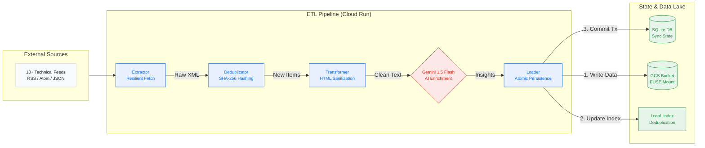

#  GCP Datanator: ETL Pipeline

GCP Datanator is a high-performance, production-grade ETL (Extract, Transform, Load) engine designed to aggregate, sanitize, and structure data from the vast ecosystem of Google Cloud and AI technical feeds. It transforms fragmented RSS/Atom streams into a unified, high-density data lake optimized for Large Language Model (LLM) ingestion, Knowledge Bases (like NotebookLM), and RAG-based search applications.

---

## 🏗️ System Architecture

The system is designed for **stateless execution with stateful persistence**, optimized for Google Cloud Run.



### Core Pipeline Components:
- **Extractor:** Handles resilient fetching with exponential backoff, jitter, and User-Agent rotation.
- **Transformer:** Sanitizes HTML, normalizes metadata, and optionally enriches data via Gemini AI.
- **Loader:** Implements a "Write-then-Commit" pattern to ensure the filesystem and database are always in sync.
- **Index Manager:** Uses local `.index` files for high-speed GUID deduplication, preventing redundant processing.

---

## 🏗️ How It Works: The ETL Lifecycle

GCP Datanator operates on a strictly sequential, fail-safe pipeline architecture to ensure data integrity and system stability.

### 1. Extraction (The "E")
The pipeline begins by fetching raw XML/JSON data from configured sources. It employs several advanced techniques to ensure reliability:
- **Intelligent Caching:** Uses `ETag` and `Last-Modified` HTTP headers to perform conditional requests (HTTP 304), saving bandwidth and processing time.
- **Content Fingerprinting:** Generates a **SHA-256 hash** of the feed content. It uses **canonicalization** to strip volatile tags (like `<lastBuildDate>`) before hashing, ensuring that only meaningful content changes trigger a sync.
- **Resilient Networking:** Implements **randomized jitter**, **exponential backoff**, and **dynamic User-Agent rotation** to bypass rate limits and handle transient network failures.
- **Deterministic Identity:** For feeds lacking unique IDs, it generates deterministic GUIDs based on entry links, ensuring consistent deduplication across runs.

### 2. Transformation (The "T")
Raw feed items are passed through a transformation layer that:
- **Sanitizes HTML:** Strips dangerous tags and normalizes content for text-based consumption.
- **Structures Metadata:** Extracts and standardizes publication dates, authors, and categories.
- **Gemini Enrichment:** (Optional) Leverages the **Gemini 1.5 Flash** model to generate executive summaries, extract actionable insights, and assign intelligent tags to the content.

### 3. Loading (The "L")
The final structured data is persisted using an atomic "Write-then-Commit" pattern:
- **Chunked Persistence:** Data is written to local disk (or a GCS FUSE mount) in structured text files.
- **Index Management:** A local `.index` file tracks every processed GUID using a high-performance lookup system to prevent duplicates.
- **Database Synchronization:** Only after the file is successfully written is the SQLite database updated. If the file write fails, the database transaction is never committed, preventing "ghost" records.

---

## 📊 Default Data Sources

GCP Datanator comes pre-configured with 10 high-value technical feeds:

| Source Name | Description |
| :--- | :--- |
| **Cloud Blog - Main** | Official Google Cloud announcements and case studies. |
| **Medium Blog** | Community-driven technical deep dives and tutorials. |
| **Google Cloud Innovation** | Strategic updates on AI infrastructure and cloud strategy. |
| **Google AI Technology** | Deep dives into the latest AI models and research. |
| **Release Notes** | Critical updates on service deprecations and feature launches. |
| **Google AI Research** | Academic-grade research papers and breakthroughs. |
| **Gemini & Workspace** | Updates on Gemini integration within Google Workspace. |
| **Service Health** | Real-time incident reports and platform status updates. |
| **Security Bulletins** | Critical security patches and vulnerability disclosures. |
| **Terraform Provider** | Infrastructure-as-Code (IaC) release tracking. |

---

## ✨ Key Features

###  Gemini Intelligence
Automatically generates high-quality summaries and insights from technical updates. It doesn't just summarize; it identifies **impact**, **required actions**, and **technical relevance** for cloud architects.

###  Fail-Proof Architecture
- **Circuit Breaker:** Automatically disables sources that fail 5 times consecutively to prevent resource exhaustion.
- **Self-Healing:** On startup, the system detects and resets "stuck" sync jobs caused by unexpected container restarts.
- **Atomic Transactions:** Ensures the SQLite database and the GCS FUSE filesystem are always in sync.

###  Midnight Slate Dashboard
A production-grade, high-contrast monitoring interface built with **React 19** and **Tailwind CSS**. It features:
- **Real-time Log Streaming:** View internal ETL metrics and network logs as they happen.
- **Source Health Monitoring:** Instant visibility into feed status, latency, and parse metrics.
- **Bento-Grid Analytics:** High-density visualization of system performance.

---

## 🔌 API Reference

GCP Datanator is designed for automation. All core functions are exposed via a RESTful API.

### Trigger Synchronization
`POST /api/v1/sync/monthly`

| Parameter | Type | Description |
| :--- | :--- | :--- |
| `triggerType` | `string` | `MANUAL` or `SCHEDULED`. |
| `sourceId` | `string` | (Optional) Sync a specific source only. |
| `force` | `boolean` | (Optional) Bypass the "already running" check. |
| `wait` | `boolean` | (Optional) If `true`, the request waits for the sync to complete before responding. **Crucial for Cloud Run.** |

**Example Request:**
```bash
curl -X POST http://localhost:3000/api/v1/sync/monthly?wait=true \
  -H "Content-Type: application/json" \
  -d '{"triggerType": "MANUAL"}'
```

### Health & Metrics
- `GET /api/v1/health`: Returns system status and database connectivity.
- `GET /api/v1/sources`: Returns a list of all configured data sources and their current health.
- `GET /api/v1/logs`: Returns a paginated list of application and network logs.

---

## ⚙️ Configuration & Environment

The application is configured via environment variables and an internal `Settings` table.

### Environment Variables
| Variable | Required | Description |
| :--- | :--- | :--- |
| `GEMINI_API_KEY` | Yes | Your API key from Google AI Studio. |
| `DATA_DIR` | No | Path to store SQLite DB and feeds (Defaults to `/app/data`). |
| `NODE_ENV` | No | `development` or `production`. |
| `PORT` | No | Defaults to `3000`. |

### SQLite Schema Deep Dive
The `gcp-datanator.db` uses several tables to maintain state:
- **`DataSources`**: Stores feed URLs, ETags, and circuit breaker status.
- **`SyncRuns`**: A historical audit log of every ETL execution, including item counts and error summaries.
- **`SourceMetrics`**: Real-time health metrics (latency, items per sync) for the dashboard.
- **`AppLogs`**: A rolling buffer of the last 500 logs (Network + Application).

---

## 📊 Monitoring & Debugging

### Debug Console
The dashboard includes a dedicated **Debug Console** that streams logs directly from the backend. It categorizes logs into:
- **INFO:** General pipeline progress (e.g., "Skipped 12 duplicates").
- **NETWORK:** Detailed HTTP metrics (Status codes, durations, redirect URLs).
- **ERROR:** Stack traces and fatal pipeline failures.

### Production Logging
In production (Cloud Run), all logs are mirrored to `stdout`. This allows you to use **Google Cloud Logging** for:
- **Log-based Metrics:** Create alerts when a specific source fails.
- **Error Reporting:** Automatically capture and notify on fatal exceptions.

### Database Maintenance
The system automatically performs a `VACUUM` and `OPTIMIZE` on the SQLite database after every sync run to ensure peak performance on network-attached storage (GCS FUSE).

---

## 🚀 Deployment

For production-grade deployment instructions, including GCS FUSE mounting and Cloud Scheduler configuration, please refer to the **[Streamlined Deployment Guide (deploy.md)](./deploy.md)**.

---

<p align="center">
  Built with ❤️ for the Google Cloud Community.
</p>
